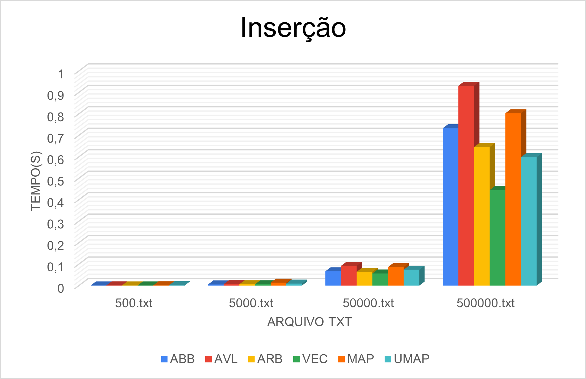
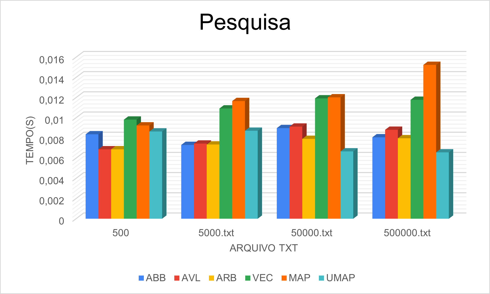
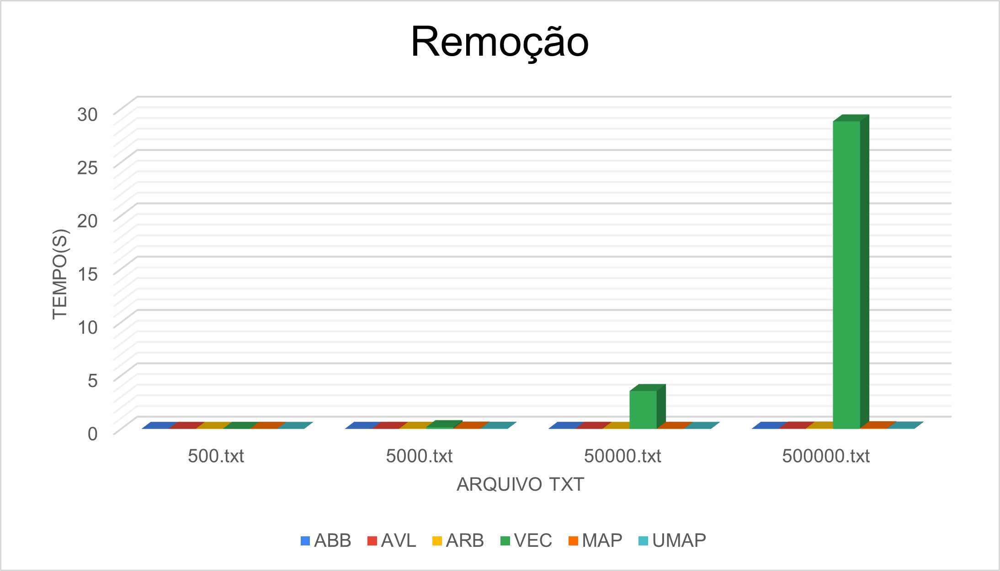

<div align="justify">


# Comparando Estruturas

<div style="display: inline-block;">
 
 
 
</a> 
</div>

## 1. Estruturas


<div align="center">
    
|             |Árvore de Busca Binária| Árvore AVL  | Árvore Rubro-negra |   Vector  |    Map   |     Unordered_map     |
|-------------|-----------------------|-------------|--------------------|-----------|----------|-----------------------|
|   Inserir   |          O(h)         |   O(log n)  |      O(log n)      |    O(1)   | O(log N) |      O(1) ou O(n)     |
|  Pesquisar  |          O(h)         |   O(log n)  |      O(log n)      |    O(n)   | O(log N) |      O(1) ou O(n)     |
|   Remover   |          O(h)         |   O(log n)  |      O(log n)      |    O(n)   | O(log N) |      O(1) ou O(n)     |
    
</div>

### 1.1 Árvore de Busca Binária

Em uma árvore binária, cada elemento é denominado nó da árvore e sua posição na estrutura pode levar a uma de três nomenclaturas. Se o nó é o primeiro inserido, denominamos tal elemento como raiz da árvore. Partindo da raiz, temos por designação dois filhos, filho esquerdo e filho direto. Um filho é posicionado a esquerda, se somente se, seu valor de teste é menor que o valor do nó onde este será conectado. Este nó de conexão é conhecido como nó pai. Por conseguinte, os filhos tidos como direitos seguem a mesma regra, contudo, para valores maiores. 

### 1.2 Árvore AVL

A árvore AVL é uma árvore de busca binária (BST) de autobalanceamento, em que a diferença entre as alturas das subárvores esquerda e direita não pode ser mais de um para todos os nós. A inserção e exclusão em árvores AVL foram discutidas no artigo anterior . Neste artigo, as operações de inserção, pesquisa e exclusão são discutidas nas árvores AVL que também possuem um ponteiro pai em sua estrutura .

### 1.3 Árvore Rubro Negra

Uma árvore vermelho-preto é um tipo de árvore de busca binária com equilíbrio automático, onde cada nó tem um bit extra, e esse bit é frequentemente interpretado como a cor (vermelho ou preto). Essas cores são usadas para garantir que a árvore permaneça equilibrada durante as inserções e exclusões. Embora o equilíbrio da árvore não seja perfeito, é bom o suficiente para reduzir o tempo de busca e mantê-lo em torno do tempo O (log n), onde n é o número total de elementos na árvore.

### 1.4 Vector

Os vetores são iguais a listas dinâmicas, com a capacidade de se redimensionar automaticamente quando um elemento é inserido ou excluído, com seu armazenamento sendo controlado automaticamente pelo contêiner. Os elementos vetoriais são colocados em um armazenamento contíguo para que possam ser acessados e percorridos usando iteradores. Nos vetores, os dados são inseridos no final. A inserção no final leva um tempo diferencial, pois às vezes pode haver a necessidade de estender o array. A remoção do último elemento leva apenas um tempo constante porque não ocorre nenhum redimensionamento. Inserir e apagar no início ou no meio é linear no tempo.

### 1.5 Map

Mapas são contêineres associativos que armazenam elementos de forma mapeada. Cada elemento possui um valor-chave e um valor mapeado. Dois valores mapeados não podem ter os mesmos valores-chave. Mapas são contêineres associativos que armazenam elementos de forma mapeada. Cada elemento possui um valor-chave e um valor mapeado. Dois valores mapeados não podem ter os mesmos valores-chave.

### 1.6 Unordered Map

De forma análoga ao map, o unordered_map é um contêiner associado que armazena elementos formados pela combinação de um valor-chave e um valor mapeado. O valor da chave é usado para identificar exclusivamente o elemento e o valor mapeado é o conteúdo associado à chave. Tanto a chave quanto o valor podem ser de qualquer tipo predefinido ou definido pelo usuário. 

O unordered_map interno é implementado usando a tabela hash: a chave fornecida para mapear é convertida em índices de uma tabela hash, é por isso que o desempenho da estrutura de dados depende muito da função hash, mas em média, o custo de pesquisa, inserção e exclusão do a tabela hash é O(1). 

## 2. Computador

### 2.1 Configuração do computador

```
Arquitetura: x84_64
Modo(s) operacional da CPU: 32-bit, 64-bit
Ordem dos bytes: Little Endian
Adress sizes: 36 bits physical, 48 bits virtual
CPU(s): 4
Lista de CPU(s) on-line: 0-3
Thread(s) per núcleo: 2
Núcleo(s) por soquete: 2
Soquete(s): 1
Nó(s) de NUMA: 1
ID de fornecedor: GenuineIntel
Família da CPU: 6
Modelo: 58
Nome do Modelo: Intel(R) Core(TM) i3-3110M CPU @ 2.40GHz
Fabricante: Intel Corp.
Informações do barramento: cpu@0
tamanho: 1364MHz
largura: 64bits
Step: 9
CPU Mhz: 1400.000
CPU Mhz máx: 2400,0000
CPU Mhz min: 1200,0000
BogoMIPS: 4789.38
Kernel: 5.15.0-50-generic
```

### 2.2 Sitema Operacional

```
Distributor ID: Ubuntu
Description: Ubuntu 20.04.4 LTS
Release: 20.04
Codename: focal
```

## 3. O Algoritmo

### 3.1 Problema Proposto 

<p align="justify"> Até o momento trabalhamos com três modelos de árvore binária, avl e redblack. Chegou o momento de compararmos tais estruturas, observando seu comportamento sob diferentes volumes de dados. Para tanto, elabore arquivos que contenham 500 , 5000 , 50.000 , 500.000 entradas numéricas do tipo ponto flutuante. Para tanto, tente evitar repetições de valores em grande escala para que possamos ter uma estrutura profunda. Considere produzir os menores a partir dos maiores volumes de forma randômica. Feito a isso, vamos testar os seguintes processos:

1) Qual o tempo gasto com pesquisa para um arquivo de entrada com 10.000 consultas. Considere como consulta a busca de um determinado número na estrutura escolhida. Para cada pesquisa, é preciso remover o elemento da árvore, retornando esse número para o usuário. Então, considere o processo de remoção como parte final do processo. 

2) Qual o tempo necessário para montar a estrutura em memória. 

3) Qual o ganho dessas estruturas ao compará-las a vetores ordenados e aplicados à pesquisa binária. Qual o tempo gasto com a ordenação do vetor? Foi possível produzi-lo em memória? 

4) Adotando como estrutura o map e unorder_map do C++, há ganhos maiores nesse processo de pesquisa?</p>

### 3.2 Estrutura dos arquivos

O código apresenta um arquivo makefile (um script que consta as instruções de como gerar um binário) e uma pasta src. A pasta src apresenta onze (11) arquivos, sendo eles o main.c e os arquivos arquivo.hpp, arquivo.cpp, binary.hpp, binary.cpp, avl.hpp, avl.cpp, fila.hpp, fila.cpp e a redblack.hpp, redblack.cpp. Na pasta src, também temos um pasta files, que contém todos os quatro arquivos txt para leitura e o arquivo txt de consulta. Os dois primeiros arquivos na pasta src, arquivo.hpp e arquivo.cpp, são responsáveis pela criação dos cinco arquivos de número ponto flutuante, e a inserção e remoção destes arquivos nas estruturas mencionados em  **1. Estruturas**. Os arquivos restantes são os arquivos onde estão contidos as estruturas de árvore de busca binária (binary.hpp, binary.cpp), a árvore avl (avl.hpp, avl.cpp, fila.hpp, fila.cpp) e a árvore rubro negra (redblack.hpp, redblack.cpp). 

### 3.3 Bibliotecas utilizadas

https://github.com/barbrina/AEDs-II/blob/978c0498e5b92eb0f0425e8956e99e5cf933c866/Comparando%20Estruturas%20em%20%C3%81rvore/src/arquivo.hpp#L4-L13

### 3.4 Estrutura do algoritmo

O código é implementado principalmente no arquivo.cpp, sendo a main.cpp apenas responsável pela chamada da função menu() e para a chamada das funções das respectivas estruturas estudadas. Os outros arquivos (binary.hpp, binary.cpp, avl.hpp, avl.cpp, fila.hpp, fila.cpp e a redblack.hpp, redblack.cpp) apresentam os métodos de inicialização, inserção, remoção, pesquisa e todas as características intrínsecas das árvores binárias. As estruturas vector, map e unordered map, por serem próprias do C++, não exigiram a criação de arquivos separados. Com isso em mente, explicarei de forma simples o conteúdo do arquivo.cpp.

#### 3.4.1 arquivo.cpp

Na main, é chamada a função `menu()`, responsável por mostrar ao usuário as estruturas que serão estudadas e deixa-lo escolher. 

https://github.com/barbrina/AEDs-II/blob/23cb45615cf4dce372b060d285295767534c7d75/Comparando%20Estruturas%20em%20%C3%81rvore/src/arquivo.cpp#L43-L56

Apos a decisão do usuário, o método escolhido é chamado. Visto que todos os métodos apresentam basicamente a mesma estrutura, utilizarei o método binary() de exemplo.

```cpp
void binary()
{
    Tree *raiz = CreateTree(); // cria a árvore binária de pesquisa
    Record r;
    
    double tempo_insert, tempo_search, tempo_remove;
    string nome = arquivo();
    
    raiz = insert_binary(nome, raiz, r, tempo_insert);
    search_binary(raiz, tempo_search);
    remove_binary(raiz, tempo_remove);


    cout << ">> O tempo gasto na árvore binária de busca foi:  " << endl;
    cout << ">> inserção: " << tempo_insert << "s" << endl;
    cout << ">> pesquisa: " << tempo_search << "s" << endl;
    cout << ">> remoção: " << tempo_remove << "s" << endl;
}
```

Primeiramente, a estrutura desejada é inicializada, no caso, a árvore binária de busca é criada. Em seguida, os tempos de inserção, pesquisa e remoção são declaradas. Estas serão passadas por referência para dentro dos métodos de `Tree *insert_binary(string nome, Tree *raiz, Record r, double &tempo)`, `void search_binary(Tree *raiz, double &tempo)` e `void remove_binary(Tree *raiz, double &tempo)` para que o tempo das mesmas seja calculado.

O nome do arquivo é declarado e para ele é passado o retorno da função `arquivo()`, função responsável por mostrar os tamanhos de arquivo disponíveis para serem preenchidos na estrutura e o usuário escolher.

https://github.com/barbrina/AEDs-II/blob/23cb45615cf4dce372b060d285295767534c7d75/Comparando%20Estruturas%20em%20%C3%81rvore/src/arquivo.cpp#L58-L86

Após isso, o arquivo escolhido pelo usuário, os dados da estrutura inicializados na função e o tempo declarado são passados como parâmetro para a função de inserção, que preenche os dados da estrutura e retorna o tempo de execução. O procedimento também é realizado com o método de pesquisa e remoção, que são bem parecidos, com a exceção que a remoção mostra os números removidos na tela. Segue exemplo do método de remoção da pesquisa binária:

```cpp
void remove_binary(Tree *raiz, double &tempo)
{
    string numero;
    double num_double;
    Tree *aux = CreateTree();
    Record r;


    // abre o arquivo para leitura
    ifstream arq("src/files/consulta.txt");


    clock_t inicio = clock();
    cout << "Valores removidos: \n";
    while (getline(arq, numero))
    {
        num_double = stod(numero); // transforma string em número flutuante
        r.key = num_double;
        removeTree(&raiz, r);
    }
    cout << "\n\n";


    clock_t fim = clock();
    tempo = (double)(fim - inicio) / CLOCKS_PER_SEC;


    arq.close();
}
```

Por fim, o tempo é mostrado na tela e novamente o menu é mostrado na tela, esperando a próxima decisão do usuário. Para encerrar o programa, o usuário precisa apensar digitar o número 7 no menu.

## 4. Resultados e Análises

As estruturas foram chamadas cinco vezes para cada tipo de arquivo e para cada tipo de método, inserção, pesquisa ou remoção. O tempo gasto para cada um dos processos foi armazenado e uma tabela com seus valores e suas respectivas incertezas estarão demonstradas a seguir. Os valores que estão em negrito são os menores e os maiores tempos para cada tipo de método e arquivo e a discussão sobre os dados encontrados foi realizada.

### 4.1 Inserção

Para os dados de inserção, temos como resultado a seguinte tabela:

<div align="center">

|                         |                   500.txt                 |   5000.txt  |  50000.txt  |  500000.txt |
|-------------------------|-------------------------------------------|-------------|-------------|-------------|
| Árvore Binária de Busca |(6.31×10<sup>-4</sup> ± 8.568×10<sup>-5</sup>)s|__(5.19×10<sup>-3</sup> ± 5.65×10<sup>-4</sup>)s__|(6.65×10<sup>-2</sup> ± 9.69×10<sup>-3</sup>)s|(7.33×10<sup>-1</sup> ± 5.82×10<sup>-2</sup>)s|
|       Árvore AVL        |(7.80×10<sup>-4</sup> ± 8.64×10<sup>-5</sup>)s|(6.61×10<sup>-3</sup> ± 4.23×10<sup>-4</sup>)s|__(9.18×10<sup>-2</sup> ± 4.70×10<sup>-3</sup>)s__|__(9.31×10<sup>-1</sup> ± 3.22×10<sup>-2</sup>)s__|
|    Árvore Rubro Negra   |__(5.51×10<sup>-4</sup> ± 1.21×10<sup>-4</sup>)s__|(6.23×10<sup>-3</sup> ± 6.95×10<sup>-4</sup>)s|(6.43×10<sup>-2</sup> ± 1.71×10<sup>-3</sup>)s|(6.45×10<sup>-1</sup> ± 1.40×10<sup>-2</sup>)s|
|          Vector         |(6.46×10<sup>-4</sup> ± 3.26×10<sup>-5</sup>)s|(5.90×10<sup>-3</sup> ± 1.97×10<sup>-4</sup>)s|__(5.63×10<sup>-2</sup> ± 3.62×10<sup>-3</sup>)s__|__(4.45×10<sup>-1</sup> ± 5.14×10<sup>-3</sup>)s__|
|           Map           |(9.19×10<sup>-4</sup> ± 1.08×10<sup>-4</sup>)s|__(1.34×10<sup>-2</sup> ± 1.02×10<sup>-2</sup>)s__|(8.62×10<sup>-2</sup> ± 3.03×10<sup>-3</sup>)s|(8.03×10<sup>-1</sup> ± 7.32×10<sup>-2</sup>)s|
|      Unordered Map      |__(1.08×10<sup>-3</sup> ± 1.32×10<sup>-4</sup>)s__|(9.23×10<sup>-3</sup> ±1.50×10<sup>-3</sup>)s|(7.37×10<sup>-2</sup> ± 4.45×10<sup>-3</sup>)s|(5.98×10<sup>-1</sup> ± 9.81×10<sup>-3</sup>)s| 
 
</div>

#### 4.1.1 Gráfico

Para melhor visualizar a tabela, segue o gráfico de inserção.

<div align="center">

</div>

#### 4.1.2 Arquivo de 500 números

Para o arquivo de 500 números, a inserção que apresentou menor resultado, foi a árvore rubro negra. O tempo de inserção, apesar de pequeno, na ordem de casa 10<sup>-4</sup>, também esteve próximo dos valores encontrados pelo vector (segundo tempo mais rápido) e pela árvore AVL (terceiro tempo mais rápido). A árvore rubro negra e a AVL ser uma das mais rápidas não é surpreentende, visto que as árvores de busca balanceadas são uma das estruturas mais eficientes que conhecemos, e estudadas neste trabalho. 

A inserção que apresentou maior resultado foi a unordored map. Isto se deve principalmente pelo fato da estrutura unordored map não ser ordenada, logo, para ocorrer a inserção, é preciso verificar toda a estrutura, pois caso tenham valores repetidos, uma rehash deve ser realizada.

#### 4.1.3 Arquivo de 5.000 números

De forma oposta aos resultados encontrados do arquivo de 500 números, o arquivo de 5000 números apresenta como tempo mais rápido de inserção, a própria árvore binária de busca. Apesar de ter sido o menor tempo, sua inserção esteve próximo das árvores avl e rubro negra, também com o vector. Esta diferença,  que a princípio pode parecer contraditória, não é, visto que a árvore binária de busca, como mencionada anteriormente, depende da ordem que os dados são inseridos. Dados bem distribuidos podem facilitar e diminuir o tempo de inserção. 

O map foi a estrutura que apresentou maior tempo de inserção, um valor consideravalmente maior do que das outras estruturas, na casa de 10<sup>-2</sup>. Isso pode ser devido ao fato de que na estrutura map, todos os elementos estão ordenados de acordo com o seu valor chave. Dessa forma os elementos são sempre inseridos em suas respectivas posições, seguindo a ordenação. Segundo a documentação, se N elementos são inseridos, a complexidade é N log(tamanho + N).

#### 4.1.4 Arquivo de 50.000 números

Para o arquivo de 50 mil números, o menor tempo de inserção foi realizado pela estrutura vector e o maior, pela árvore AVL. A estrutura vector apresentar o tempo mais rápido de inserção pode parecer um resultado interessante de primeira, mas o método de inserção utilizado, o push back, apresenta um "tempo amortizado constante". 

A análise amortizada é uma técnica de análise que examina uma sequência de operações. Se a sequência inteira for executada no tempo T(n) , cada operação na sequência será executada em T(n)/n. A idéia é que, embora algumas operações na sequência possam ser caras, elas não podem acontecer com frequência suficiente para sobrecarregar o programa. Os vetores em C++ são implementados com matrizes, para aumentar o tamanho de um vetor, deve-se realocar a memória e copiar toda a matriz. Obviamente, não gostaríamos de fazer isso com muita frequência. Portanto, se executarmos uma operação push_back e o vetor precisar alocar mais espaço, aumentará o tamanho em um fator. Agora, isso requer mais memória, que você pode não usar por completo, mas as próximas operações push_back são executadas em tempo constante.

Apesar do vetor ter sido o mais rápido, todas as leituras apresentaram tempo relativamente parecido, na ordem de 10<sup>-2</sup>.

A árvore AVL, que apresentou o tempo de inserção mais lento, teve resultados próximos as estruturas map e unordered map. A explicação para este tipo de resultado pode ser devido a ordem de inserção, que pode ter feito com que a árvore avl passe por sucessivas rotações para a deixar balanceada, o que pode ter ocasionado neste tempo maior em relação as outras estruturas.

#### 4.1.5 Arquivo de 500.000 números

Assim como o arquivo de 50 mil números, o arquivo de 500 mil números demonstrou que novamente, o tempo mais curto de inserção foi a estrutura vector e o mais longo, pela árvore avl. Isso demonstra que para inserções de dados muito grandes, ambas as estruturas são respectivamente melhor e pior para inserção.

#### 4.1.5 Análise

Dessa forma, para resolver problemas em que uma boa quantidade de dados será inserida, para pequena massa de dados, o ideal seria escolher alguma árvore binária, balanceada ou não. Já para uma grande massa de dados, a estrutura vector pode ser considerada, por além de apresentar uma rápida inserção, ser fácil de criar e de se utilizar, sendo uma ferramenta própria e disponível pelo próprio C++.

### 4.2 Pesquisa

Para os dados de pesquisa, temos como resultado a seguinte tabela:
<div align="center">

|                         |                    500.txt              |   5000.txt  |  50000.txt  |  500000.txt |
|-------------------------|-----------------------------------------|-------------|-------------|-------------|
| Árvore Binária de Busca |(8.36×10<sup>-3</sup> ± 1.84×10<sup>-3</sup>)s|__(7.31×10<sup>-3</sup> ± 1.01×10<sup>-3</sup>)s__|(8.97×10<sup>-3</sup> ± 1.34×10<sup>-3</sup>)s|(8.06×10<sup>-3</sup> ± 1.74×10<sup>-3</sup>)s|
|       Árvore AVL        |__(6.88×10<sup>-3</sup> ± 5.76×10<sup>-4</sup>)s__|(7.44×10<sup>-3</sup> ± 7.58×10<sup>-4</sup>)s|(9.12×10<sup>-3</sup> ± 2.44×10<sup>-3</sup>)s|(8.81×10<sup>-3</sup>±1.20×10<sup>-3</sup>)s|
|    Árvore Rubro Negra   |(6.88×10<sup>-3</sup> ± 1.65×10<sup>-3</sup>)s|(7.35×10<sup>-3</sup> ± 7.55×10<sup>-4</sup>)s|(7.91×10<sup>-3</sup> ± 1.08×10<sup>-3</sup>)s|(7.97×10<sup>-3</sup>±4.77×10<sup>-4</sup>)s|
|          Vector         |__(9.81×10<sup>-3</sup> ± 9.76×10<sup>-4</sup>)s__|(1.09×10<sup>-2</sup> ± 3.85×10<sup>-4</sup>)s|(1.19×10<sup>-2</sup> ± 2.05×10<sup>-3</sup>)s|(1.18×10<sup>-2</sup>±3.14×10<sup>-4</sup>)s|
|           Map           |(9.24×10<sup>-3</sup> ± 4.11×10<sup>-4</sup>)s|__(1.17×10<sup>-2</sup> ± 5.53×10<sup>-4</sup>)s__|__(1.20×10<sup>-2</sup> ± 2.52×10<sup>-3</sup>)s__|__(1.52×10<sup>-2</sup> ± 3.90×10<sup>-3</sup>)s__|
|      Unordered Map      |(8.64×10<sup>-3</sup> ± 1.73×10<sup>-3</sup>)s|(8.71×10<sup>-3</sup> ± 9.26×10<sup>-4</sup>)s|__(6.67×10<sup>-3</sup> ± 8.06×10<sup>-4</sup>)s__|__(6.57×10<sup>-3</sup> ± 6.70×10<sup>-5</sup>)s__|

</div>

#### 4.2.1 Gráfico

Para melhor visualizar a tabela, segue o gráfico de pesquisa.

<div align="center">

</div>

#### 4.2.2 Arquivo de 500 números

Para a pesquisa de quinhentos números, o menor tempo de execução foi referente a árvore AVL. Este resultado é condizente pois árvores AVL é balanceada, dessa forma, o tempo de procura dos dados é igual a O(log n) para médio e pior caso, sendo O(1), para o melhor caso. Este tempo também foi próximo da árvore rubro negra, o que mostra que as árvores de balanceamento são ótimas para pesquisa quando se tem uma pequena base de dados de procura.

O maior tempo de execução, referente a pesquisa, foi o vector. Para pesquisa, foi utilizado uma busca binária dentro do vetor, um algoritmo que implementa o paradigma divisão e conquista para encontrar um elemento na estrutura. Este tempo está próximo do tempo da estrutura map e unordored map e não é tão surpreendente, visto que temos uma base de dados pequena e pequenas variações de tempo podem acontecer, o que não significa que o algoritmo é ruim. 

#### 4.2.3 Arquivo de 5.000 números

O menor tempo de execuração para pesquisa de arquivos de cinco mil números é da árvore binária de busca. O tempo também esteve próximo das árvores AVL e árvore rubro negra e demonstra ser um resultado condizente, pois o tempo para pesquisa de uma árvore binária é O (log n) e ela depende dos números que estão sendo pesquisados.

O maior tempo de execução é da estrutura map, tempo este que também esteve próximo da estrutura vector, mencionada na seção anterior. Os motivos são principalmente aqueles mencionados em 3.2.1 para o vector, mais uma vez reafirmando que, para uma pequena base de dados, a estrutura map e vector apresenta maior dificuldade para encontrar seus elementos.

#### 4.2.4 Arquivo de 50.000 números

O menor tempo execução para cinquenta mil números é da estrutura unordered map. A unordered map é implementada usando uma tabela hash, como mencionado na seção 1. Estruturas, e dessa forma, o seu tempo de pesquisa é igual O(1). Dessa forma, se os elementos estão bem dispersos na hash, mais fácil é encontrar seu elemento, assim, diminuindo o tempo de busca. É claro que tudo isso depende da base de dados de pesquisa. Outro fator é de que, por ser uma estrutura boa para pesquisa e implementada pelo próprio C++, ela é mais otimizada para tal.

Novamente, o maior tempo de execução para arquivo de cinquenta mil números é da estrutura map e os motivos para esta demora na pesquisa são explicitados na seção anterior.

#### 4.2.5 Arquivo de 500.000 números

Assim como o arquivo de cinquenta mil o menor tempo de execução e o maior tempo de execução são, respectivamente, as estruturas  unordered map e o map, corroborando com a ideia de que para uma grande base de dados, melhor é a pesquisa. 

#### 4.2.6 Análise

Para resolver problemas em que a base de dados será pesquisada o tempo todo, para uma pequena base de dados, uma árvore de pesquisa pode ser considerada. Já para uma grande base de dados, as próprias ferramentas fornecidas pelo C++ podem ser boas opções, o map ou o unordered map. 

### 4.3 Remoção

Para os dados de remoção, temos como resultado a seguinte tabela:
<div align="center">

|                         |                     500.txt                   |                  5000.txt                 |             50000.txt                      |               500000.txt                  |
|-------------------------|-----------------------------------------------|-------------------------------------------|-------------|-------------|
| Árvore Binária de Busca |__(4.56×10<sup>-3</sup> ± 7.30×10<sup>-4</sup>)s__|__(8.54×10<sup>-3</sup> ± 1.97×10<sup>-4</sup>)s__|(8.97×10<sup>-3</sup> ± 1.34×10<sup>-3</sup>)s|__(1.57×10<sup>-2</sup> ± 1.85×10<sup>-3</sup>)s__|
|       Árvore AVL        |(5.52×10<sup>-3</sup> ± 6.96×10<sup>-4</sup>)s|(1.29×10<sup>-2</sup> ± 2.07×10<sup>-4</sup>)s|(9.12×10<sup>-3</sup> ± 2.44×10<sup>-3</sup>)s|3.36×10<sup>-2</sup> ± 9.33×10<sup>-4</sup>)s|
|    Árvore Rubro Negra   |(5.71×10<sup>-3</sup> ± 9.63×10<sup>-4</sup>)s|(1.75×10<sup>-2</sup> ± 4.89×10<sup>-4</sup>)s|(7.91×10<sup>-3</sup> ± 1.08×10<sup>-3</sup>)s|(3.83×10<sup>-2</sup> ± 1.90×10<sup>-3</sup>)s|
|          Vector         |__(1.07×10<sup>-2</sup> ± 1.67×10<sup>-4</sup>)s__|__(1.67×10<sup>-1</sup> ± 2.52×10<sup>-4</sup>)s__|__(3.55 ± 2.05×10<sup>-3</sup>)s__|__(2.88×10<sup>1</sup> ± 4.68×10<sup>-1</sup>)s__|
|           Map           |(9.40×10<sup>-3</sup> ± 2.97×10<sup>-4</sup>)s|(3.08×10<sup>-2</sup> ± 9.63×10<sup>-4</sup>)s|(1.20×10<sup>-2</sup> ± 1.22×10<sup>-1</sup>)s|6.47×10<sup>-2</sup> ± 4.38×10<sup>-3</sup>)s|
|      Unordered Map      |(7.79×10<sup>-3</sup> ± 6.75×10<sup>-4</sup>)s|(2.31×10<sup>-2</sup> ± 1.55×10<sup>-4</sup>)s|__(6.67×10<sup>-3</sup> ± 8.06×10<sup>-4</sup>)s__|(3.57×10<sup>-2</sup> ± 1.96×10<sup>-3</sup>)s|

</div>

#### 4.3.1 Gráfico

Para melhor visualizar a tabela, segue o gráfico de inserção.

<div align="center">

</div>

Visto que nos casos de remoção de qualquer tamanho de arquivo o vector apresenta o pior tempo de execução, ele será mencionado apenas uma vez. O principal problema do vector é a remoção de todos os elementos (menos o último) deve ser seguida por um redimensionamento. Isso faz com que o vector custe O(n), o que para arquivos muito grandes, a remoção simplesmente não é viável. A clara demonstração é através de nosso código, para remover elementos de um arquivo de 500 mil números, o tempo de execução é de 28 segundos!

Para os arquivos de quinhentos, cinco mil e quinhentos mil números, a árvore binária de pesquisa apresentou o menor tempo de remoção. Este apresenta ser um resultado adequado, visto que a remoção da árvore binária não exige rotações ou transformações em sua árvore, apenas uma simples mudança de dados, diferentemente do que ocorre nas árvores balanceadas. Este tempo esteve próximo da estrutura unordored map, que apresentou o menor tempo de execução para o arquivo de cinquenta mil números. Como o unordered map é implementado como uma hash, ele apenas remove o elemento, sem precisar ordenar ou redimensionar, assim, tornando o rápido e eficiente.

#### 4.3.1 Análise

Para remoção, apenas o vector não vale a pena ser utilizada para uma base de dados maior que 25 elementos, pelos motivos mencionados anteriormente. As outras estruturas são boas alternativas e devem ser consideradas para resolverem um determinado tipo de problema.

## 5. Conclusão

Este trabalho consistiu em implementar e comparar seis diferentes estruturas de dados para inserção, pesquisa e remoção de número ponto flutuante. A análise realizada foi apenas superficial, não existem respostas certas ou erradas para comparações de tempos de estruturas de dados. Diversos fatores interferem para que, as vezes, a melhor estrutura para solucionar determinado tipo de problema não apresente o melhor resultado. __Alguns__ dos fatores que podem influenciar o tempo de resposta das estruturas de dados são os seguintes:

- Ordem de inserção, de pesquisa, e remoção;
- Arquitetura do computador;
- Sistema operacional;
- Métodos para realizar os processos no algoritmo;
- Método o qual o tempo é calculado;
- Imprecisão de medida do próprio computador.

É importante ressaltar também que não existem estruturas melhores ou piores, apenas estruturas mais adequadas para solucionar determinados tipo de problemas, como pudemos ver na análise dos resultados do trabalho. Deve se levar em consideração que os dados encontrados são verdadeiros para o sistema e a arquitetura de computador nas quais as leituras foram realizadas (ver seção __#2.2 Configuração do computador__), podendo apresentar diferentes respostas caso as especificações sejam alteradas.

Para trabalhos futuros, a pesquisa ideal seria utilizando escalas de centenas até bilhões de dados, em diversos sistemas operacionais e arquiteturas diferentes de computador, testando diversas formas de entradas de números e possibilidades.
 
## 6. Compilação e Execução

O algoritmo disponibilizado possui um arquivo makefile que realiza todo o procedimento de compilação e execução. Para tanto, temos as seguintes diretrizes de execução:

<div>

| Comando                |  Função                                                                                           |
| -----------------------| ------------------------------------------------------------------------------------------------- |
|  `make clean`          | Apaga a última compilação realizada contida na pasta build                                        |
|  `make`                | Executa a compilação do programa utilizando o gcc, e o resultado vai para a pasta build           |
|  `make run`            | Executa o programa da pasta build após a realização da compilação                                 |
|  `make r`              | Apaga, builda e executa o programa                                                                |

</div>


## 7. Referências Bibliogŕaficas

P. Feofiloff. **_Análise de Algoritmos_**. Internet: http://www.ime.usp.br/~pf/analise_de_algoritmos/, 1999–2009
 

</div>


