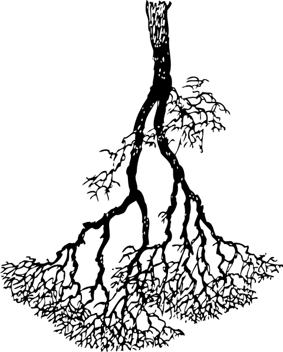
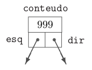

# Comparando Estruturas em Árvore

 
 
 
</a> 

## 1. Árvore Binária

 Uma árvore binária $(= binary$ $tree)$ é um conjunto de registros que satisfaz certas condições. Os registros serão chamados nós (poderiam também ser chamados células).  Cada nó tem um endereço.  Suporemos por enquanto que cada nó tem apenas três campos:  um número inteiro e dois ponteiros para nós.  Os nós podem, então, ser definidos assim: 

 
 

 
 
 

 O campo conteudo é a "carga útil" do nó;  os dois outros campos servem apenas para dar estrutura à árvore. O campo esq de cada nó contém $NULL$ ou o endereço de outro nó. Uma hipótese análoga vale para o campo $dir$. Se o campo $esq$ de um nó $P$ é o endereço de um nó $E$, diremos que $E$ é o filho esquerdo de $P$. Analogamente, se $P.dir$ é igual a & $D$, diremos que $D$ é o filho direito de $P$. Se um nó $F$ é filho (esquerdo ou direito) de $P$, diremos que $P$ é o pai de $F$. Uma folha $(= leaf)$ é um nó que não tem filho algum. 

É muito conveniente confundir, verbalmente, cada nó com seu endereço.  Assim, se $x$ é um ponteiro para um nó (ou seja, se $x$ é do tipo $*noh$), dizemos  "considere o nó $x$"  em lugar de  "considere o nó cujo endereço é $x$". A seguir, uma representação esquemática de uma árvore binária cujos nós contêm os números 2, 7, 5, etc. 

 
 

 
 
 

## 2. Árvore AVL

## 3. Árvore Rubro Negra

## 4. O Algoritmo

### 4.1 Problema Proposto 

 Até o momento trabalhamos com três modelos de árvore, binária, avl e redblack. Chegou o momento de compararmos tais estruturas, observando seu comportamento sob diferentes volumes de dados. Para tanto, elabore arquivos que contenham 500 , 5000 , 50.000 , 500.000 entradas numéricas do tipo ponto flutuante. Para tanto, tente evitar repetições de valores em grande escala para que possamos ter uma estrutura profunda. Considere produzir os menores a partir dos maiores volumes de forma randômica. Feito a isso, vamos testar os seguintes processos:

1) Qual o tempo gasto com pesquisa para um arquivo de entrada com 10.000 consultas. Considere como consulta a busca de um determinado número na estrutura escolhida. Para cada pesquisa, é preciso remover o elemento da árvore, retornando esse número para o usuário. Então, considere o processo de remoção como parte final do processo. 

2) Qual o tempo necessário para montar a estrutura em memória. 

3) Qual o ganho dessas estruturas ao compará-las a vetores ordenados e aplicados à pesquisa binária. Qual o tempo gasto com a ordenação do vetor? Foi possível produzi-lo em memória? 

4) Adotando como estrutura o map e unorder_map do C++, há ganhos maiores nesse processo de pesquisa?

### 4.2 Estrutura dos arquivos

  

### 4.3 Bibliotecas utilizadas

### 4.4 Estrutura do algoritmo

 
## 5. Compilação e Execução

O algoritmo disponibilizado possui um arquivo makefile que realiza todo o procedimento de compilação e execução. Para tanto, temos as seguintes diretrizes de execução:

| Comando                |  Função                                                                                           |
| -----------------------| ------------------------------------------------------------------------------------------------- |
|  `make clean`          | Apaga a última compilação realizada contida na pasta build                                        |
|  `make`                | Executa a compilação do programa utilizando o gcc, e o resultado vai para a pasta build           |
|  `make run`            | Executa o programa da pasta build após a realização da compilação                                 |
|  `make r`              | Apaga, builda e executa o programa                                                                |

## 6. Referências Bibliogŕaficas

P. Feofiloff. **_Análise de Algoritmos_**. Internet: http://www.ime.usp.br/~pf/analise_de_algoritmos/, 1999–2009
 
P. Feofiloff. **_Código de Huffman_**. Internet: https://www.ime.usp.br/~pf/analise_de_algoritmos/aulas/huffman.html, 1999–2009

