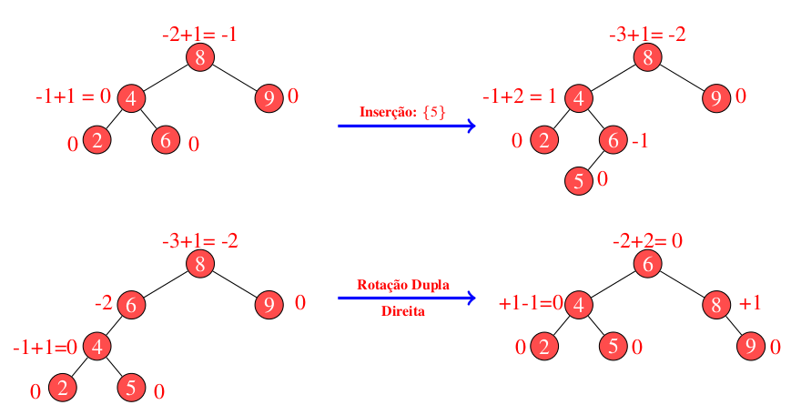
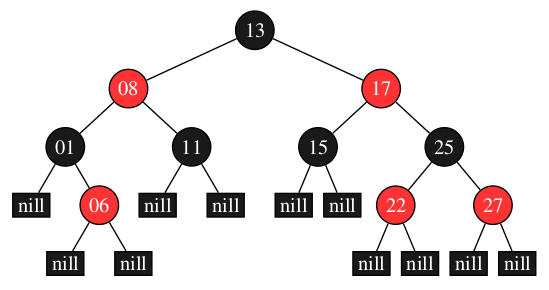
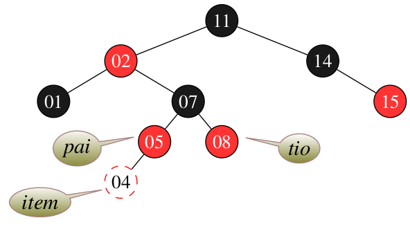
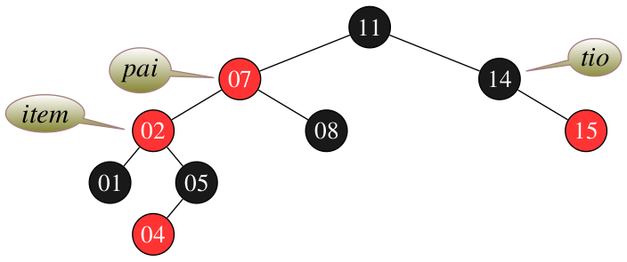
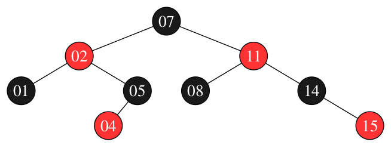
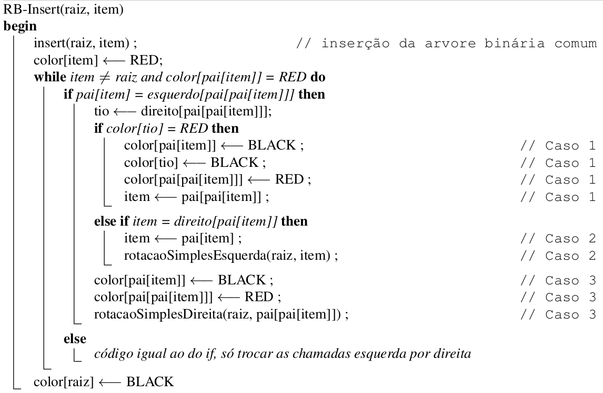

# Comparando Estruturas em Árvore

 
 
 
</a> 

## 1. Árvore Binária

 Uma árvore binária $(= binary$ $tree)$ é um conjunto de registros que satisfaz certas condições. Os registros serão chamados nós (poderiam também ser chamados células).  Cada nó tem um endereço.  Suporemos por enquanto que cada nó tem apenas três campos:  um número inteiro e dois ponteiros para nós.  Os nós podem, então, ser definidos assim: 

 
 

 
 
 Fig 1. Conteúdo de cada nó de uma árvore. 

 
 

 O campo conteudo é a "carga útil" do nó;  os dois outros campos servem apenas para dar estrutura à árvore. O campo esq de cada nó contém $NULL$ ou o endereço de outro nó. Uma hipótese análoga vale para o campo $dir$. Se o campo $esq$ de um nó $P$ é o endereço de um nó $E$, diremos que $E$ é o filho esquerdo de $P$. Analogamente, se $P.dir$ é igual a & $D$, diremos que $D$ é o filho direito de $P$. Se um nó $F$ é filho (esquerdo ou direito) de $P$, diremos que $P$ é o pai de $F$. Uma folha $(= leaf)$ é um nó que não tem filho algum. 

É muito conveniente confundir, verbalmente, cada nó com seu endereço.  Assim, se $x$ é um ponteiro para um nó (ou seja, se $x$ é do tipo $*noh$), dizemos  "considere o nó $x$"  em lugar de  "considere o nó cujo endereço é $x$". A seguir, uma representação esquemática de uma árvore binária cujos nós contêm os números 2, 7, 5, etc. 

 
 

 
 
 Fig 2. Exemplo de árvore binária. 

 
 

## 2. Árvore AVL (Adelson-Velskii and Landis)

  Em uma árvore binária do tipo AVL, os nós se mantêm aprocimadamente balanciados. Isso permite que processos de inserção, remoção e pesquisa sejam realizados sob custo computacional de $O(lg n)$. 

 Para a realização dos balanceamentos, a AVL modifica o método de inserção da árvore binária, introduzindo nela um procedimento de avaliação de peso e quatro modelos de rotação. 

 O fator de peso é utilizado para identificar quando a árvore se apresenta desbalanceada, para com isso identificar que tipo de rotação é preciso empregar na estrutura para que essa volta e se manter aproximadamente balanceada. A abordagem do fator de peso pode ser observada através da Fig 3.  

 

 Fig 3. Exemplo de árvore AVL. 

	Observe, por meio da representação da Fig 3, que os fatores de peso podem se apresentar entre -1 e +1. Isso demonstra que a árvore em questão está balanceada segundo suas regras. Para obter esse fator de peso, consideramos a avaliação do nível de altura do filho mais profundo de cada sub-árvore (i.e., esquerda e direita). Quando uma sub-árvore esquerda é avaliada, seu valor de peso se apresenta como negativo. Pelo contrário, quando a sub-árvore direita é observada, essa leva para os níveis mais acima valores positivos de altura. Então, uma árvore AVL se encontra desbalanceada se o fator de peso de um dado nó excede o limiar entre -1 e +1. Neste caso, as rotações são realizadas para retornar a estrutura à condições aceitáveis. 

	Em uma árvore AVL desbalanceada, um total de 4 rotações podem ser realizadas, duas simples e duas duplas. Considera-se rotações simples esquerda e/ou direita a movimentação da estrutura em um único processo. Essas são aplicadas sempre que o fator de peso do nó desbalanceado coincidir em sinal com a sub-árvore que levou ao desbalanceamento. Observe abaixo na Fig 4 um exemplo de rotação simples para direita. Neste, note que o sinal dos fatores de peso do nó que gerou o desbalanceamento (i.e., nó 8) e da sub-árvore causadora do mesmo (i.e., 4) são iguais. Isso caracteriza uma rotação simples para direita, uma vez que ambos os sinais são negativos, o que indica que o desbalanceamento gerado está na esquerda.   

  

 <caption> Fig 4. Exemplo de rotação à direita para rebalanceameto da árvore binária.</caption> 

	Considerando ainda o exemplo da Fig 4, observe que ao produzir o rebalanceamento necessário, neste caso, obtivemos duas grandes modificações. Primeiro, como o desbalanceamento ocorreu na raiz da árvore, essa sofreu modificação, deixando de ser o nó 8 para se tornar o nó 4. Segundo, o filho direito de 4, representado pelo nó 6, deixa de conectar a ele para se tornar o filho esquerdo do nó 8. Esse segundo passo é necessário para garantir a integridade das regras básicas de uma árvore binária, a qual define a existência de apenas um filho na esquerda e um como filho direito. Então, ao imaginar a rotação é preciso observar essas peculiaridades para não errar a recomposição da estrutura. Vejamos agora como proceder sob modelos de rotação dupla. A Fig 3 detalha um exemplo para este caso. 

 

 <caption> Fig 5. Exemplo de rotação dupla à direita para rebalanceameto da árvore binária.</caption> 

	Em uma rotação dupla, conforme pode ser observado na Fig 5, dois movimentos são necessários. Para detecnar a necessidade desses movimentos, basta observar o sinal atribuído ao fator de do nó desbalanceado e o da sub-árvore causadora do problema. Note que, o nó desbalanceado mais uma vez é o nó cujo valor é 8. Nesse nó temos um fator de peso de -2, o que indica um desbalanceamento de sua sub-árvore esquerda. Já em sua sub-árvore esquerda observamos um fator de peso positivo, o que indica a necessidade de rotação dupla para correção. Neste caso, primeiramente produzimos uma rotação simples na sub-árvore esquerda para igualar seu sinal de fator de peso ao sinal do nó desbalanceado. Feito isso, produzimos uma segunda rotação ao contrário para corrigir o nó sinalizado no início como desbalanceado. Note que ao produzir rotações nos filhos, valores maiores que 1 podem ser produzidos, como no caso do nó 6 que recebeu após rotação um fator de -2. Embora saibamos que esse valor indica desbalanceamento, este é ignorado, uma vez que, tal fator só foi produzido após rotação de correção. Além disso, observe que para alinhar corretamente a estrutura, os nós de valor 5 e 6 foram realinhados. Isso é preciso porque ao realizar a rotação sem o realinhamento a composição da árvore ficará errada, tendo como filho direito do nó 6 o nó cujo valor é 5. Então, ao detectar uma rotação dupla, observe se o primeiro giro fará com que a integridade da estrutura se mantenha. Caso contrário, faça primeiro o alinhamento conforme demonstrado no exemplo, depois gire a estrutura.  

	Segundo a representação da Fig 5, ao detectar o desbalanceamento, foi identificado a necessidade de uma rotação dupla para a direita. Isso é confirmado observando o sinal do nó desbalanceado, no caso o nó 8. Neste, o fator de desbalanceamento é negativo, o que indica a necessidade de rotação para a direita. Já no filho, o fator é positivo, o que confirma a necessidade de ser uma rotação dupla, devido a incompatibilidade de sinal com o nó 8. Dessa forma, podemos concluir que, uma rotação dupla para direita e/ou esquerda é composta de duas rotações simples. A primeira, feita na sub-árvore, é realizada sempre para o contrário da rotação identificada, ou seja, para uma rotação dupla direita, rodamos a sub-árvore para esquerda e vice versa. Então, o título da rotação se dá pelo fator que produziu o desbalanceamento na hora de uma inserção ou remoção. 

## 3. Árvore Rubro Negra

	Em uma árvore binária do tipo Red Black (RB), os nós se mantêm aprocimadamente balanciados por meio de uma estratégia de cores. Diferente da AVL, em uma RB os nós são avaliados considerando um processo de parentesco, em que vizinhos são considerados e esses devem obedecer certos critérios de cor para indicar que a estrutura se encontra balanceada. Isso permite que processos de inserção, remoção e pesquisa sejam realizados sob custo computacional de O(logn). Um exemplo da estrutura de uma RB pode ser observada na Fig 6.

   
  <caption>Fig 6. Exemplo de estrutura de uma árvore binária do tipo Red Black.</caption>

Considerando o exemplo da Fig. 6, a estrutura RB define uma série de regras para que a estrutura se mantenha balanceda, são elas: 

>
> 1. Todo nó é vermelho ou preto
> 2. A raiz é sempre preta, mesmo sendo o único nó
> 3. Todo nó folha define seus filhos em nulo e esses são considerados sendo pretos. 
> 4. Se um nó é vermelho, então ambos os vizinhos são pretos.
> 5. Para todo nó, todos os caminhos até as folhas apresentam o mesmo número de nós pretos. 
> 6. Para cada nova inserção, o novo nó começa com a cor vermelha.
>

	Para que a estrutura RB se mantenha em conformidade com as 6 diretrizes acima apresentadas, sua construção é realizada adotando-se 3 casos de análise para cada nova inserção e remoção. Além disso, diferente da AVL, essa estrutura se baseia apenas em rotações simples para corrigir a falta de balanceamento entre suas sub-árvores.

>
> **Caso 1**: A inserção de um novo nó vermelho deve 'GARANTIR' que seus vizinhos, i.e., nós próximos a um nível acima, considerados como pai e tio, devem ser pretos. 
>  

   
  <caption>Fig 7. Definição do caso 1 para uma estrutura em que a inserção do nó com valor 4 produz um desbalanceamento.</caption>

Considerando a Fig. 7, uma correção na estrutura deve ser realizada para deixá-la em conformidade com as regras apresentadas. Nesse contexto, considerando o caso 1, a solução é deixar o pai e tio pretos e avançar os ponteiros da estrutura sentido raiz, o que induzirá uma avaliação do caso 2. A Fig. 8 detalha o processo realizado no caso 1 que leva a estrutura para a análise do caso 2. 

>
> **Caso 2**: O tio de um nó (i.e., item) é preto, o item e seu pai são vermelhos e o item é o filho da direita.
> 

   
  <caption>Fig 8. Correção da estrutura considerando o problema abordado no caso 1.</caption>

Uma vez feita a correção do caso 1, os ponteiros de análise são atualizados para um nível acima conforme detalhando na Fig 8, o que nos leva ao caso 2. Neste caso há necessidade de executar uma correção por rotação. Essa é realizada a partir do pai e é realizada para a esquerda conforme exemplo da Fig 9. 

   
  <caption>Fig 9. Correção da estrutura considerando o problema abordado no caso 2.</caption>

	Uma vez realizada a rotação, note que os ponteiros de pai e item são atualizados, bem como, a organização de filhos se compararmos com a estrutura da Fig 8 que detalha a RB antes da rotação. 

	Ao realizar a rotação programada pelo caso 2, chega-se a última etapa de análise e correção, o caso 3. 

>
> **Caso 3**: O tio do item é preto, o item e seu pai são vermelhos e o item é o filho da esquerda. 
> 

Como forma de atendimento ao caso 3, o pai do pai deve ser aplicado a uma troca de cor (e.g., nesse caso o nó com valor 11 passa a ser vermelho) e a árvore rotacionada para a direita. A Fig 10 detalha esse processo e a árvore resultante após a finalização da análise e rotações.

   
  <caption>Fig 10. Correção da estrutura considerando o problema abordado no caso 3.</caption>

 Após a finalização do caso 3, a estrutura volta a se encontrar balanceada. Para termos certeza basta identificar o número de nós pretos desde a raiz até as folhas, esses devem se apresentar em mesmo número para todos os caminhos. Se isso for verdade, a estrutura se encontrará correta. Por fim, a Fig 11 detalha um pseudo algoritmo que une os três casos segundo Cormen at. all. 

   
  <caption>Fig 11. Pseudo algoritmo de balanceamento adotado pela árvore Red Black segundo Cormen at all.</caption>

	Segundo Cormen at. all, após a aplicação das estratégias acima abordadas para o balanceamento, a altura <i>h</i> de uma árvore RB com <i>n</i> chaves é de no máximo 2log(n+1). A prova é por indução e pode ser observada em detalhes no capítulo 13 do livro Algoritmos: Teoria e Prática. Por fim, como vantagem em comparação com a AVL, a RB emprega apenas rotações simples e não adota recursão para avaliar seus casos, o que pode beneficiar sua utilização para estruturas muito profundas.  

## 4. O Algoritmo

### 4.1 Problema Proposto 

 Até o momento trabalhamos com três modelos de árvore, binária, avl e redblack. Chegou o momento de compararmos tais estruturas, observando seu comportamento sob diferentes volumes de dados. Para tanto, elabore arquivos que contenham 500 , 5000 , 50.000 , 500.000 entradas numéricas do tipo ponto flutuante. Para tanto, tente evitar repetições de valores em grande escala para que possamos ter uma estrutura profunda. Considere produzir os menores a partir dos maiores volumes de forma randômica. Feito a isso, vamos testar os seguintes processos:

1) Qual o tempo gasto com pesquisa para um arquivo de entrada com 10.000 consultas. Considere como consulta a busca de um determinado número na estrutura escolhida. Para cada pesquisa, é preciso remover o elemento da árvore, retornando esse número para o usuário. Então, considere o processo de remoção como parte final do processo. 

2) Qual o tempo necessário para montar a estrutura em memória. 

3) Qual o ganho dessas estruturas ao compará-las a vetores ordenados e aplicados à pesquisa binária. Qual o tempo gasto com a ordenação do vetor? Foi possível produzi-lo em memória? 

4) Adotando como estrutura o map e unorder_map do C++, há ganhos maiores nesse processo de pesquisa?

### 4.2 Estrutura dos arquivos

  

### 4.3 Bibliotecas utilizadas

### 4.4 Estrutura do algoritmo

 
## 5. Compilação e Execução

O algoritmo disponibilizado possui um arquivo makefile que realiza todo o procedimento de compilação e execução. Para tanto, temos as seguintes diretrizes de execução:

| Comando                |  Função                                                                                           |
| -----------------------| ------------------------------------------------------------------------------------------------- |
|  `make clean`          | Apaga a última compilação realizada contida na pasta build                                        |
|  `make`                | Executa a compilação do programa utilizando o gcc, e o resultado vai para a pasta build           |
|  `make run`            | Executa o programa da pasta build após a realização da compilação                                 |
|  `make r`              | Apaga, builda e executa o programa                                                                |

## 6. Conclusão

## 7. Referências Bibliogŕaficas

P. Feofiloff. **_Análise de Algoritmos_**. Internet: http://www.ime.usp.br/~pf/analise_de_algoritmos/, 1999–2009
 

