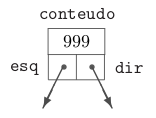

# Código de Huffman

## 1. Árvore Binária

<p align="justify"> Uma árvore binária $(= binary$ $tree)$ é um conjunto de registros que satisfaz certas condições. Os registros serão chamados nós (poderiam também ser chamados células).  Cada nó tem um endereço.  Suporemos por enquanto que cada nó tem apenas três campos:  um número inteiro e dois ponteiros para nós.  Os nós podem, então, ser definidos assim: </p>

<div align="center">
 <p> </p>
 
 <p> </p>
</div>

<p align="justify"> O campo conteudo é a "carga útil" do nó;  os dois outros campos servem apenas para dar estrutura à árvore. O campo esq de cada nó contém $NULL$ ou o endereço de outro nó. Uma hipótese análoga vale para o campo $dir$. Se o campo $esq$ de um nó $P$ é o endereço de um nó $E$, diremos que $E$ é o filho esquerdo de $P$. Analogamente, se $P.dir$ é igual a & $D$, diremos que $D$ é o filho direito de $P$. Se um nó $F$ é filho (esquerdo ou direito) de $P$, diremos que $P$ é o pai de $F$. Uma folha $(= leaf)$ é um nó que não tem filho algum. </p>

<p align="justify">É muito conveniente confundir, verbalmente, cada nó com seu endereço.  Assim, se $x$ é um ponteiro para um nó (ou seja, se $x$ é do tipo $*noh$), dizemos  "considere o nó $x$"  em lugar de  "considere o nó cujo endereço é $x$". A seguir, uma representação esquemática de uma árvore binária cujos nós contêm os números 2, 7, 5, etc. </p>

<div align="center">
 <p> </p>
 
 <p> </p>
</div>

## 2. Árvore de Huffman

 Trata-se de uma codificação de caracteres que permite compactar arquivos de texto, ou seja, representar um arquivo de texto A por um arquivo de bits B bem menor. O algoritmo de Huffman calcula uma tabela de códigos sob medida para o arquivo A de modo que o arquivo B seja o menor possível. O algoritmo de Huffman é um bom exemplo de **algoritmo guloso[^1]**.


[^1]: **Algoritmo guloso** Estratégia gulosa é aquela usada por um montanhista que decide caminhar sempre "para cima", na direção de "maior subida", na esperança de assim chegar ao pico mais alto da montanha. (Como todos sabemos, essa estratégia nem sempre produz o resultado esperado). Um algoritmo guloso escolhe, em cada iteração, o objeto mais "apetitoso" que vê pela frente. (A definição de "apetitoso" é estabelecida a priori, antes da execução do algoritmo.) O objeto escolhido passa a fazer parte da solução que o algoritmo constrói.

<p align="justify"> De maneira informal, a codificação Huffman é um algoritmo de compressão de dados sem perdas. A ideia é atribuir códigos de comprimento variável aos caracteres de entrada, sendo que os comprimentos dos códigos atribuídos são baseados nas frequências dos caracteres correspondentes. O caractere mais frequente recebe o menor código e o caractere menos frequente recebe o maior código.
 
Os códigos de comprimento variável atribuídos aos caracteres de entrada são códigos de prefixo, significa que ***os códigos (sequências de bits) são atribuídos de tal forma que o código atribuído a um caractere não é o prefixo do código atribuído a nenhum outro caractere.*** É assim que o código de Huffman garante que não haja ambiguidade ao decodificar o fluxo de bits gerado. 

<p align="justify"> Para entender os códigos de prefixo, usaremos um contra-exemplo. Sejam quatro caracteres $a$, $b$, $c$ e $d$, e seus códigos de comprimento variável correspondentes sejam $00$, $01$, $0$ e $1$. Essa codificação leva à ambiguidade porque o código atribuído a $c$ é o prefixo dos códigos atribuídos a $a$ e $b$. Se o fluxo de bits compactado for $0001$, a saída descompactada poderá ser “ $cccd$ ” ou “ $ccb$ ” ou “ $acd$ ” ou “ $ab$ ”. </p>

### 2.1 Implementação do algoritmo

<p>  É natural usar uma árvore binária usual como estrutura de dados para representar uma árvore de Huffman. Para uma implementação não recursiva do algoritmo de Huffman, basta representar árvores de Huffman com folhas unitárias. </p>

Cada nó da árvore de Huffman será representado por uma célula dotada de quatro campos: $esq$, $dir$, $índice$ e $p$. Para cada célula $z$, $esq[z]$ é o endereço do filho esquerdo de $z$ e $dir[z]$ é o endereço do filho direito de $z$. Se $z$ representa uma folha então $esq[z]$ = $dir[z]$ = $nil$. Se $z$ não representa uma folha então $índice[z]$ é irrelevante. Se $z$ representa uma folha {i} então $índice[z] = i$. Para cada $z$,  $p[z]$ é o peso do nó da árvore que a célula $z$ representa.

Podemos agora reescrever o algoritmo de Huffman em estilo iterativo. Vamos supor que o conjunto-suporte $S$ é {1, 2, … , n}. O algoritmo recebe uma ponderação $p$ de $S$ e devolve o endereço da raiz de uma árvore binária que representa uma árvore de Huffman ótima com folhas unitárias. </p>

```
Huffman (n, p)
1 Q := Nova-Fila-com-Prioridades ( )
2 para i crescendo de 1 até n
3     z := Cria-Célula ( )
4     índice[z] := i
5     p[z] := pi
6     esq[z] := dir[z] := nil
7     Insere-na-Fila (Q, z)
8     enquanto Q tiver 2 ou mais células
9 x := Extrai-Min (Q)
10    y := Extrai-Min (Q)
11    z := Cria-Célula ( )
12    esq[z] := x
13    dir[z] := y
14    p[z] := p[x] + p[y]
15    I  nsere-na-Fila (Q, z)
16 r := Extrai-Min (Q)
17 devolva r
```

<p>  A operação Nova-Fila-com-Prioridades () cria uma fila-com-prioridades vazia. Os elementos da fila serão células e a prioridade de cada célula $z$ é $p[z]$. A operação Cria-Célula gera uma nova célula e devolve o endereço dessa célula. A operação Insere-na-Fila $(Q, z)$ insere a célula $z$ na fila $Q$.

As linhas 1 a 7 constroem as folhas da árvore. As demais linhas constroem os nós internos e a estrutura da árvore. A operação Extrai-Min $(Q)$ nas linhas 9 e 10 retira da fila-com-prioridades $Q$ uma célula que tem $p$ mínimo.

No início de cada iteração temos uma floresta composta de duas ou mais árvores. (No início da primeira iteração, cada árvore tem apenas um nó.) Durante a iteração, o algoritmo escolhe duas raízes e funde as correspondentes árvores. No fim da última iteração, a floresta tem uma única árvore.</p>

### 2.2 Desempenho

<p align="justify"> Se a fila-com-prioridades for implementada como um vetor ordenado, cada execução de inserir na fila e extrair o mínimo elemento consumirá $Ο(m)$ unidades de tempo, sendo m o número de células na fila Q. Como $m ≤ n$ e há n repetições do bloco de linhas 1 a 7 e n−1 repetições do bloco de linhas 9 a 15, o consumo de tempo total do algoritmo será $Ο(n²)$.  Se a fila-com-prioridades for implementada como um min-heap, cada execução de Insere-na-Fila e Extrai-Min consumirá $O(n lg n)$ unidades de tempo. Com isso, o consumo total será de </p>

$O(n lg n)$

<p> unidades de tempo.  </p>

### 2.3 Aplicação

<p align="justify"> A principal aplicação prática do algoritmo de Huffman é o cálculo de códigos binários para compressão de arquivos, ou seja, a transformação de um arquivo de caracteres em uma sequência de bits que ocupa pouco espaço. A ideia é usar poucos bits para representar os caracteres mais frequentes e mais bits para representar os mais raros. No caso deste projeto, a idea é análoga a esta, apenas trocando a representação de caracteres mais frequentes para palavras mais frequentes do texto. </p>

## 3. O Algoritmo

### 3.1 Problema Proposto 

<p align="justify"> Elabore uma árvore binária que utilize o código de Huffman para comprimir arquivos. Para tanto, (1) contabilizar a recorrência de cada palavra (RP) no arquivo; (2) normalizar a contabilização entre 0 e 1 utilizando a formula -> RP / (max(RP) - min(RP)); (3) Montar a árvore com as regras apresentadas por Huffman; (4) Troque as palavras pela codificação binária (utilizar booleano para representar 0 e 1); (5) Salve o arquivo em formato binário e observe qual foi o ganho de espaço obtido. </p>


### 3.2 Estrutura dos arquivos

<p align="justify"> O código apresenta um arquivo makefile (um script que consta as instruções de como gerar um binário) e uma pasta src. A pasta src apresenta cinco arquivos, sendo eles o main.c, responsável pela chamada das principais funções, e os arquivos arquivo.hpp, arquivo.cpp, huffman.hpp e huffman.cpp. Os dois primeiros arquivos, arquivo.hpp e arquivo.cpp, são responsáveis pela leitura do arquivo de texto, tratamento das palavras e inserção das mesmas no map. Os dois últimos, huffman.hpp e huffman.cpp, são responsáveis pela criação da min-heap, da árvore de huffman e a leitura e salvamento da codificação no arquivo binário. A pasta src também apresenta uma pasta files, onde consta o arquivo de texto, texto.txt, que será comprimido e o arquivo binário, codificado.bin, já com a codificação. </p>

### 3.3 Bibliotecas utilizadas

https://github.com/barbrina/AEDs-II/blob/e2438f65d933daa38f1196d302746be2df892d9a/C%C3%B3digo%20de%20Huffman/src/huffman.hpp#L4-L14

### 3.4 Estrutura do algoritmo

<p align="justify"> O código é dividido em dois pedaços, o primeiro onde o arquivo é lido e as palavras são tratadas, e o segundo, onde a árvore é criada e a codificação é enviada para o arquivo binário. Dessa forma, explicarei separadamente os dois principais arquivos do algoritmo na ordem a qual eles são excecutados: o arquivo.cpp e o huffman.hpp.

#### 3.4.1 arquivo.cpp

Na main, a primeira função a ser chamada é `abre_arq(map <string, float> *mapa, vector<string> *palavras)` e são repassados como parâmetros um ponteiro map de string e float, e um ponteiro vector de string que foram criados na main.
 
 ```c
 map<string, float> mapa;
vector<string> palavras;

abre_arq(&mapa, &palavras);
 ```
 
Nesta função, o arquivo de leitura texto.txt é aberto, as palavras são lidas, tokenizadas e tratadas. Em seguida, as palavras são inseridas no vector de palavras e no map pela função `encontra_palavra(map <string, float> *mapa, string palavra)` e recebem como valor mapeado o 1. As palavras que estão sendo inseridas pela segunda ou mais vezes não são adicionadas novamente, apenas são incrementadas no ponto flutuante. Por fim, o arquivo é fechado.
 
https://github.com/barbrina/AEDs-II/blob/86e05e2ec36d252bfbf6585394437bddf9c14ec1/C%C3%B3digo%20de%20Huffman/src/arquivo.cpp#L4-L42
 
Após a conclusão da leitura de todas as palavras na main, a formula de RP é calculada através da função `formula_rp(map<string, float> *mapa)` e para ela é passado como parâmetro o ponteiro de map com a palavras e a recorrência das mesmas. A fórmula utilizada para o cálculo de recorrência foi a seguinte:
 
$$ x = {RP(atual) \over RP(máx) - RP(mín)} $$

Após pegar a recorrencia da palavra atual e dividi-la pela subtração da recorrencia da palavra de maior recorrencia, através do método  float `float max_valor(map<string, float> *mapa)` e pela de menor recorrencia `float min_valor(map<string, float> *mapa)`, o resultado nos dá a frequência que é atualizada na própria map.
 
Na main, o multimap é criado com os valores de float, representando a frequência e a string representando a palavra. Em seguida, a função ordena  `void ordena(map<string, float> &mapa, multimap<float, string> &mmapa)` é chamada, passando como parâmetro o map e o multimap. O objetivo desta função é passar todos os valores contidos em map, para multimap e ordenar as palavras em relação a frequência das mesmas, ao invés da ordem alfabética.
 
 ```c
 string *data = new string[mmapa.size()]; // cria lista de palavras
 float *freq = new float[mmapa.size()];   // cria lista de frequencias
 passar_array(&mmapa, data, freq); // passa os valores da multimap para as listas
```
 
Uma string de ponteiro e um float de ponteiro são criados e alocados dinamicamente na main. A função `void passar_array(multimap<float, string> *mmapa, string data[], float freq[])`  com os parâmetros das listas mencionadas anteriormente e o multimap. O multimap é percorrido e as palavras e a frequência das mesmas são repassadas para estas listas, de modo a serem usadas posteriormentes para a criação da árvore de huffman.

#### 3.4.2 huffman.cpp
 
Para a parte final do programa, um ponteiro Minheap *root para a raiz da árvore de huffman foi criado e ele recebe o retorno da função `MinHeapNode *codigo_huffman(string data[], float freq[], int tamanho)`.
 
```c
MinHeapNode *root; // cria um ponteiro para a raiz da árvore de huffman
root = codigo_huffman(data, freq, mapa.size());
```
 
Função esta que chama outra função `MinHeapNode *arvore_huffman(string data[], float freq[], int tamanho)` e repassa os ponteiros de string e float criadas na main, com as respectivas palavras e suas frequências. Esta função é responsável por uma das duas partes principais do código de huffman: construir a árvore de huffman a partir das strings de entrada e ela é dividida em quatro passos que serão explicados a seguir.
 
https://github.com/barbrina/AEDs-II/blob/a4ad775d9450cd6e53511ebebc7284a8eb8104e1/C%C3%B3digo%20de%20Huffman/src/huffman.cpp#L130-L151
 
- **Passo 1**: Criar uma folha para cada string e construir uma min heap de todas as folhas (Min heap é usado como uma fila de prioridade). O valor do campo de frequência é usado para comparar dois nós na min heap. Inicialmente, a string menos frequente é a raiz.
 
```c
// cria uma min heap de capacidade igual ao tamanho e insere todas as palavras nele. Tamanho inicial da min heap é igual a capacidade
MinHeap *cria_constroi_minheap(string data[], float freq[], int tamanho)
{
    MinHeap *minHeap = cria_minheap(tamanho);

    for (int i = 0; i < tamanho; ++i)
    {
        minHeap->array[i] = novo_no(data[i], freq[i]);
    }

    minHeap->tamanho = tamanho;
    constroi_minheap(minHeap);

    return minHeap;
}
```
 
- **Passo 2**: Extrair dois nós com a menor frequência da min heap.
 
```c
// função para extrair o menor valor do nó da heap
MinHeapNode *extrai_min(MinHeap *minHeap)
{
    MinHeapNode *temp = minHeap->array[0];
    minHeap->array[0] = minHeap->array[minHeap->tamanho - 1];

    --minHeap->tamanho;
    minHeapify(minHeap, 0);

    return temp;
}
```

- **Passo 3**: Criar um novo nó interno com a frequência igual a soma da frequência dos dois nós. Fazer o primeiro nó extraído como o filho esquerdo e o outro nó extraído como seu nó direito. Adicionar esse nó na min heap.
 
```c
 // função para alocar um novo nó min heap com dada string e sua frequencia
MinHeapNode *novo_no(string data, float freq)
{
    MinHeapNode *temp = (MinHeapNode *)malloc(sizeof(MinHeapNode));

    temp->esq = temp->dir = NULL;
    temp->data = (char *)malloc(data.size() * sizeof(char));
    strcpy(temp->data, data.c_str());
    temp->freq = freq;

    return temp;
}
 ```
 
- **Passo 4**: Repetir os passos 2 e 3 e inserir os nós até que a árvore contenha apenas um nó. O nó remanescente é a raiz e a árvore está completa.

 ```c
 // função para inserir um novo nó na min heap
void insere_minheap(MinHeap *minHeap, MinHeapNode *minHeapNode)
{

    ++minHeap->tamanho;
    int i = minHeap->tamanho - 1;

    while (i && minHeapNode->freq < minHeap->array[(i - 1) / 2]->freq)
    {
        minHeap->array[i] = minHeap->array[(i - 1) / 2];
        i = (i - 1) / 2;
    }

    minHeap->array[i] = minHeapNode;
}
 ```
 
A segunda parte principal do código de Huffman é atravessar toda a árvore e associar códigos as strings. Esta parte será realizada na função final da main `void salva_arquivo(MinHeapNode *root, map<string, float> mapa, vector<string> palavras)`. A função salva_arquivo é responsável por ler a vector string de palavras que armazenou as palavras no texto a medida que elas foram aparecendo, procurar estas palavras no map para pegar a frequência, e por fim, chamar a função `void procura(MinHeapNode *root, string data, float freq, int arr[], int top, string &nome)`, responsável por recursivamente passar por toda a árvore a procura da palavra e a cada interação com o nó esquerdo ou direito, armazenar a codificação em uma int arr[].
 
 https://github.com/barbrina/AEDs-II/blob/0a472cc7bb01aea1c4385e0ee014326acb8b2a8d/C%C3%B3digo%20de%20Huffman/src/huffman.cpp#L223-L245
 
 <p> A cada palavra encontrada, o array de inteiros é transformado em string, que é utilizado na função salva_arquivo para escrever a codificação em arquivo binário codifica.bin. O código pode ser printado na tela descomentando a linha: </p>
 
 https://github.com/barbrina/AEDs-II/blob/0a472cc7bb01aea1c4385e0ee014326acb8b2a8d/C%C3%B3digo%20de%20Huffman/src/huffman.cpp#L188
 
## 4. Exemplo
 
 <p> Segue um exemplo de como ficaria o arquivo de saída com o seguinte arquivo de entrada </p>
 
### 4.1 Arquivo de Entrada
https://github.com/barbrina/AEDs-II/blob/7ded50f157a23f524fcc4ab7fc320ce67dbbcbb4/C%C3%B3digo%20de%20Huffman/src/files/texto.txt#L1-L138 
 
### 4.2 Arquivo de Saída
 https://github.com/barbrina/AEDs-II/blob/7ded50f157a23f524fcc4ab7fc320ce67dbbcbb4/C%C3%B3digo%20de%20Huffman/src/files/codificado.bin#L1 
 
## 5. Compilação e Execução

O algoritmo disponibilizado possui um arquivo makefile que realiza todo o procedimento de compilação e execução. Para tanto, temos as seguintes diretrizes de execução:

<div>

| Comando                |  Função                                                                                           |
| -----------------------| ------------------------------------------------------------------------------------------------- |
|  `make clean`          | Apaga a última compilação realizada contida na pasta build                                        |
|  `make`                | Executa a compilação do programa utilizando o gcc, e o resultado vai para a pasta build           |
|  `make run`            | Executa o programa da pasta build após a realização da compilação                                 |
|  `make r`              | Apaga, builda e executa o programa                                                                |

</div>

## 6. Referências Bibliogŕaficas

P. Feofiloff. **_Análise de Algoritmos_**. Internet: http://www.ime.usp.br/~pf/analise_de_algoritmos/, 1999–2009
 
P. Feofiloff. **_Código de Huffman_**. Internet: https://www.ime.usp.br/~pf/analise_de_algoritmos/aulas/huffman.html, 1999–2009


